# Sequence Diagrams — SECS Business Flows

**Phiên bản**: 1.0  
**Ngày tạo**: 2026-07-11  
**Mục đích**: Mô tả chi tiết các luồng nghiệp vụ dưới dạng sequence diagram trước khi triển khai code.

---

## Danh sách luồng nghiệp vụ

1. [SF-01] Server Startup & DB Migration
2. [SF-02] SSO Login (OIDC/PKCE flow)
3. [SF-03] JWT Verification Middleware
4. [SF-04] Maker tao SQL Request (DRAFT -> PENDING)
5. [SF-05] Checker Review & Approve (PENDING -> APPROVED -> EXECUTED)
6. [SF-06] Checker Reject Request (PENDING -> REJECTED)
7. [SF-07] Maker Cancel Request (PENDING -> CANCELLED)
8. [SF-08] SQL Execution voi Timeout & Transaction
9. [SF-09] WebSocket Realtime Notification
10. [SF-10] Admin quan ly Database Connections
11. [SF-11] Admin cap/thu quyen User tren Database
12. [SF-12] Health Check Endpoint

---

## [SF-01] Server Startup & DB Migration

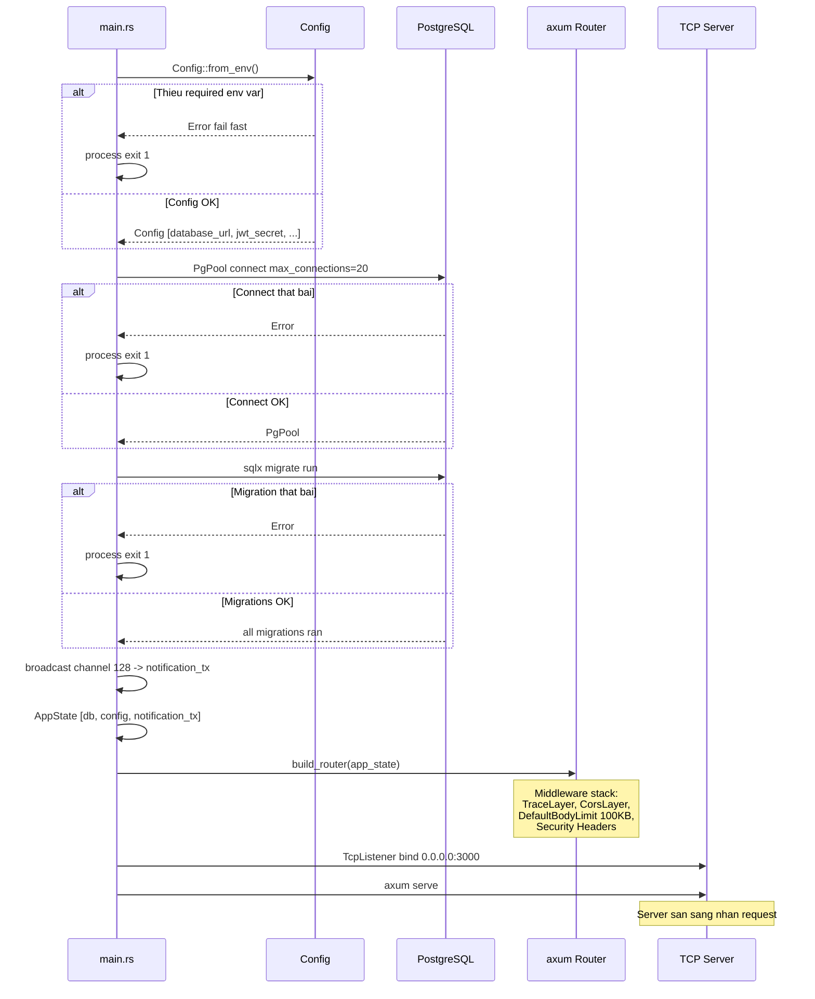
```mermaid
sequenceDiagram
    participant Main as main.rs
    participant Cfg as Config
    participant DB as PostgreSQL
    participant Router as axum Router
    participant Server as TCP Server

    Main->>Cfg: Config::from_env()
    alt Thieu required env var
        Cfg-->>Main: Error fail fast
        Main->>Main: process exit 1
    else Config OK
        Cfg-->>Main: Config [database_url, jwt_secret, ...]
    end

    Main->>DB: PgPool connect max_connections=20
    alt Connect that bai
        DB-->>Main: Error
        Main->>Main: process exit 1
    else Connect OK
        DB-->>Main: PgPool
    end

    Main->>DB: sqlx migrate run
    alt Migration that bai
        DB-->>Main: Error
        Main->>Main: process exit 1
    else Migrations OK
        DB-->>Main: all migrations ran
    end

    Main->>Main: broadcast channel 128 -> notification_tx
    Main->>Main: AppState [db, config, notification_tx]
    Main->>Router: build_router(app_state)
    Note over Router: Middleware stack:<br/>TraceLayer, CorsLayer,<br/>DefaultBodyLimit 100KB,<br/>Security Headers
    Main->>Server: TcpListener bind 0.0.0.0:3000
    Main->>Server: axum serve
    Note over Server: Server san sang nhan request
```

---

## [SF-02] SSO Login (OIDC/PKCE Flow)

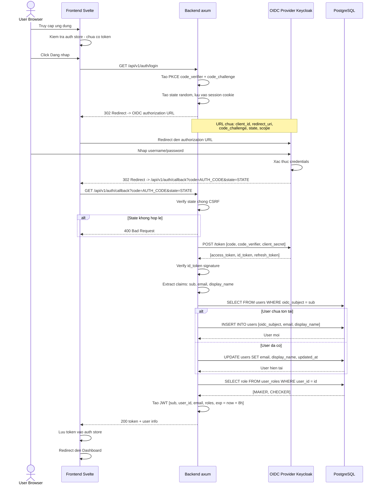
```mermaid
sequenceDiagram
    actor User as User Browser
    participant FE as Frontend Svelte
    participant BE as Backend axum
    participant OIDC as OIDC Provider Keycloak
    participant DB as PostgreSQL

    User->>FE: Truy cap ung dung
    FE->>FE: Kiem tra auth store - chua co token
    User->>FE: Click Dang nhap
    FE->>BE: GET /api/v1/auth/login
    BE->>BE: Tao PKCE code_verifier + code_challenge
    BE->>BE: Tao state random, luu vao session cookie
    BE-->>FE: 302 Redirect -> OIDC authorization URL
    Note over BE,OIDC: URL chua: client_id, redirect_uri,<br/>code_challenge, state, scope

    FE->>OIDC: Redirect den authorization URL
    User->>OIDC: Nhap username/password
    OIDC->>OIDC: Xac thuc credentials
    OIDC-->>FE: 302 Redirect -> /api/v1/auth/callback?code=AUTH_CODE&state=STATE

    FE->>BE: GET /api/v1/auth/callback?code=AUTH_CODE&state=STATE
    BE->>BE: Verify state chong CSRF
    alt State khong hop le
        BE-->>FE: 400 Bad Request
    end

    BE->>OIDC: POST /token [code, code_verifier, client_secret]
    OIDC-->>BE: [access_token, id_token, refresh_token]

    BE->>BE: Verify id_token signature
    BE->>BE: Extract claims: sub, email, display_name

    BE->>DB: SELECT FROM users WHERE oidc_subject = sub
    alt User chua ton tai
        BE->>DB: INSERT INTO users [oidc_subject, email, display_name]
        DB-->>BE: User moi
    else User da co
        BE->>DB: UPDATE users SET email, display_name, updated_at
        DB-->>BE: User hien tai
    end

    BE->>DB: SELECT role FROM user_roles WHERE user_id = id
    DB-->>BE: [MAKER, CHECKER]

    BE->>BE: Tao JWT [sub, user_id, email, roles, exp = now + 8h]
    BE-->>FE: 200 token + user info

    FE->>FE: Luu token vao auth store
    FE->>FE: Redirect den Dashboard
```

---

## [SF-03] JWT Verification Middleware

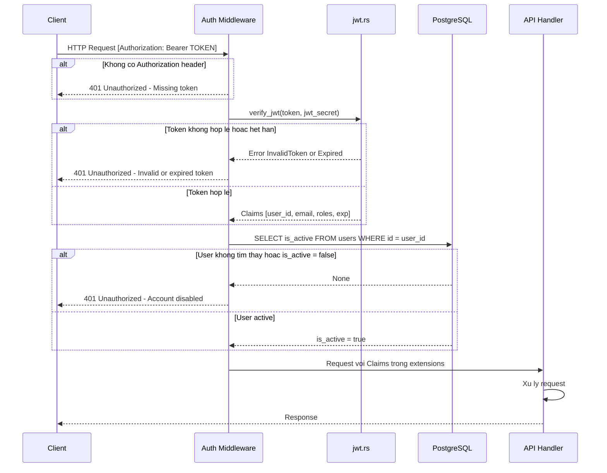
```mermaid
sequenceDiagram
    participant Client as Client
    participant MW as Auth Middleware
    participant JWT as jwt.rs
    participant DB as PostgreSQL
    participant Handler as API Handler

    Client->>MW: HTTP Request [Authorization: Bearer TOKEN]

    alt Khong co Authorization header
        MW-->>Client: 401 Unauthorized - Missing token
    end

    MW->>JWT: verify_jwt(token, jwt_secret)
    alt Token khong hop le hoac het han
        JWT-->>MW: Error InvalidToken or Expired
        MW-->>Client: 401 Unauthorized - Invalid or expired token
    else Token hop le
        JWT-->>MW: Claims [user_id, email, roles, exp]
    end

    MW->>DB: SELECT is_active FROM users WHERE id = user_id
    alt User khong tim thay hoac is_active = false
        DB-->>MW: None
        MW-->>Client: 401 Unauthorized - Account disabled
    else User active
        DB-->>MW: is_active = true
    end

    MW->>Handler: Request voi Claims trong extensions
    Handler->>Handler: Xu ly request
    Handler-->>Client: Response
```

---

## [SF-04] Maker tao SQL Request (DRAFT -> PENDING)

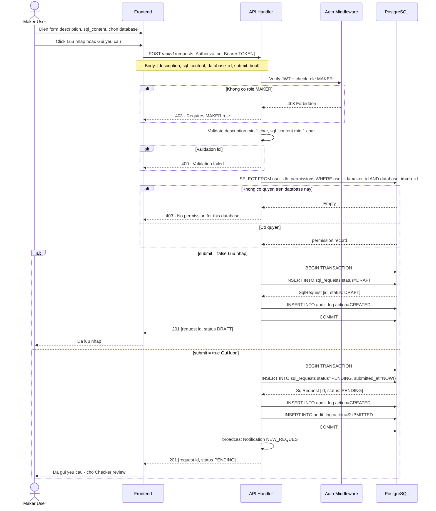
```mermaid
sequenceDiagram
    actor Maker as Maker User
    participant FE as Frontend
    participant BE as API Handler
    participant Auth as Auth Middleware
    participant DB as PostgreSQL

    Maker->>FE: Dien form description, sql_content, chon database
    Maker->>FE: Click Luu nhap hoac Gui yeu cau

    FE->>BE: POST /api/v1/requests [Authorization: Bearer TOKEN]
    Note over FE,BE: Body: [description, sql_content, database_id, submit: bool]

    BE->>Auth: Verify JWT + check role MAKER
    alt Khong co role MAKER
        Auth-->>BE: 403 Forbidden
        BE-->>FE: 403 - Requires MAKER role
    end

    BE->>BE: Validate description min 1 char, sql_content min 1 char
    alt Validation loi
        BE-->>FE: 400 - Validation failed
    end

    BE->>DB: SELECT FROM user_db_permissions WHERE user_id=maker_id AND database_id=db_id
    alt Khong co quyen tren database nay
        DB-->>BE: Empty
        BE-->>FE: 403 - No permission for this database
    else Co quyen
        DB-->>BE: permission record
    end

    alt submit = false Luu nhap
        BE->>DB: BEGIN TRANSACTION
        BE->>DB: INSERT INTO sql_requests status=DRAFT
        DB-->>BE: SqlRequest [id, status: DRAFT]
        BE->>DB: INSERT INTO audit_log action=CREATED
        BE->>DB: COMMIT
        BE-->>FE: 201 [request id, status DRAFT]
        FE-->>Maker: Da luu nhap
    else submit = true Gui luon
        BE->>DB: BEGIN TRANSACTION
        BE->>DB: INSERT INTO sql_requests status=PENDING, submitted_at=NOW()
        DB-->>BE: SqlRequest [id, status: PENDING]
        BE->>DB: INSERT INTO audit_log action=CREATED
        BE->>DB: INSERT INTO audit_log action=SUBMITTED
        BE->>DB: COMMIT
        BE->>BE: broadcast Notification NEW_REQUEST
        BE-->>FE: 201 [request id, status PENDING]
        FE-->>Maker: Da gui yeu cau - cho Checker review
    end
```

---

## [SF-05] Checker Approve & He thong Thuc thi SQL

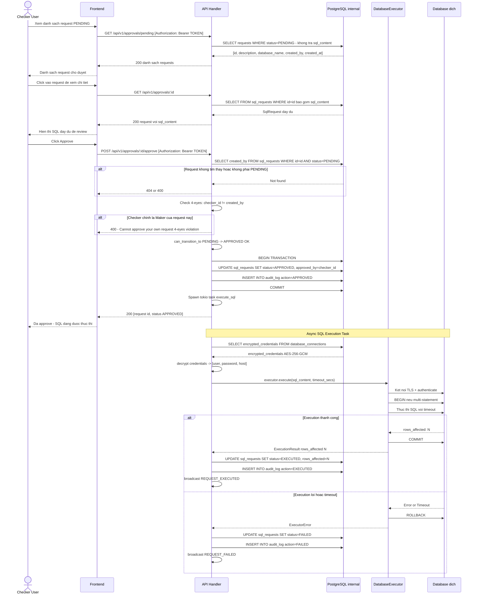
```mermaid
sequenceDiagram
    actor Checker as Checker User
    participant FE as Frontend
    participant BE as API Handler
    participant DB as PostgreSQL internal
    participant Executor as DatabaseExecutor
    participant TargetDB as Database dich

    Checker->>FE: Xem danh sach request PENDING
    FE->>BE: GET /api/v1/approvals/pending [Authorization: Bearer TOKEN]
    BE->>DB: SELECT requests WHERE status=PENDING - khong tra sql_content
    DB-->>BE: [id, description, database_name, created_by, created_at]
    BE-->>FE: 200 danh sach requests
    FE-->>Checker: Danh sach request cho duyet

    Checker->>FE: Click vao request de xem chi tiet
    FE->>BE: GET /api/v1/approvals/:id
    BE->>DB: SELECT FROM sql_requests WHERE id=id bao gom sql_content
    DB-->>BE: SqlRequest day du
    BE-->>FE: 200 request voi sql_content
    FE-->>Checker: Hien thi SQL day du de review

    Checker->>FE: Click Approve
    FE->>BE: POST /api/v1/approvals/:id/approve [Authorization: Bearer TOKEN]

    BE->>DB: SELECT created_by FROM sql_requests WHERE id=id AND status=PENDING
    alt Request khong tim thay hoac khong phai PENDING
        DB-->>BE: Not found
        BE-->>FE: 404 or 400
    end

    BE->>BE: Check 4-eyes: checker_id != created_by
    alt Checker chinh la Maker cua request nay
        BE-->>FE: 400 - Cannot approve your own request 4-eyes violation
    end

    BE->>BE: can_transition_to PENDING -> APPROVED OK

    BE->>DB: BEGIN TRANSACTION
    BE->>DB: UPDATE sql_requests SET status=APPROVED, approved_by=checker_id
    BE->>DB: INSERT INTO audit_log action=APPROVED
    BE->>DB: COMMIT

    BE->>BE: Spawn tokio task execute_sql
    BE-->>FE: 200 [request id, status APPROVED]
    FE-->>Checker: Da approve - SQL dang duoc thuc thi

    Note over BE,TargetDB: Async SQL Execution Task

    BE->>DB: SELECT encrypted_credentials FROM database_connections
    DB-->>BE: encrypted_credentials AES-256-GCM
    BE->>BE: decrypt credentials -> [user, password, host]
    BE->>Executor: executor.execute(sql_content, timeout_secs)

    Executor->>TargetDB: Ket noi TLS + authenticate
    Executor->>TargetDB: BEGIN neu multi-statement
    Executor->>TargetDB: Thuc thi SQL voi timeout

    alt Execution thanh cong
        TargetDB-->>Executor: rows_affected: N
        Executor->>TargetDB: COMMIT
        Executor-->>BE: ExecutionResult rows_affected N
        BE->>DB: UPDATE sql_requests SET status=EXECUTED, rows_affected=N
        BE->>DB: INSERT INTO audit_log action=EXECUTED
        BE->>BE: broadcast REQUEST_EXECUTED
    else Execution loi hoac timeout
        TargetDB-->>Executor: Error or Timeout
        Executor->>TargetDB: ROLLBACK
        Executor-->>BE: ExecutorError
        BE->>DB: UPDATE sql_requests SET status=FAILED
        BE->>DB: INSERT INTO audit_log action=FAILED
        BE->>BE: broadcast REQUEST_FAILED
    end
```

---

## [SF-06] Checker Reject Request

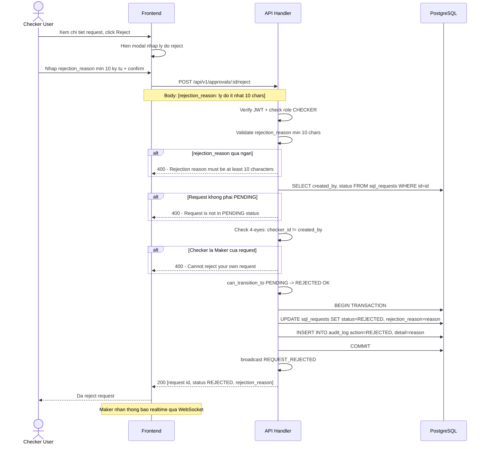
```mermaid
sequenceDiagram
    actor Checker as Checker User
    participant FE as Frontend
    participant BE as API Handler
    participant DB as PostgreSQL

    Checker->>FE: Xem chi tiet request, click Reject
    FE->>FE: Hien modal nhap ly do reject
    Checker->>FE: Nhap rejection_reason min 10 ky tu + confirm

    FE->>BE: POST /api/v1/approvals/:id/reject
    Note over FE,BE: Body: [rejection_reason: ly do it nhat 10 chars]

    BE->>BE: Verify JWT + check role CHECKER
    BE->>BE: Validate rejection_reason min 10 chars
    alt rejection_reason qua ngan
        BE-->>FE: 400 - Rejection reason must be at least 10 characters
    end

    BE->>DB: SELECT created_by, status FROM sql_requests WHERE id=id
    alt Request khong phai PENDING
        BE-->>FE: 400 - Request is not in PENDING status
    end

    BE->>BE: Check 4-eyes: checker_id != created_by
    alt Checker la Maker cua request
        BE-->>FE: 400 - Cannot reject your own request
    end

    BE->>BE: can_transition_to PENDING -> REJECTED OK

    BE->>DB: BEGIN TRANSACTION
    BE->>DB: UPDATE sql_requests SET status=REJECTED, rejection_reason=reason
    BE->>DB: INSERT INTO audit_log action=REJECTED, detail=reason
    BE->>DB: COMMIT

    BE->>BE: broadcast REQUEST_REJECTED
    BE-->>FE: 200 [request id, status REJECTED, rejection_reason]
    FE-->>Checker: Da reject request
    Note over FE: Maker nhan thong bao realtime qua WebSocket
```

---

## [SF-07] Maker Cancel Request

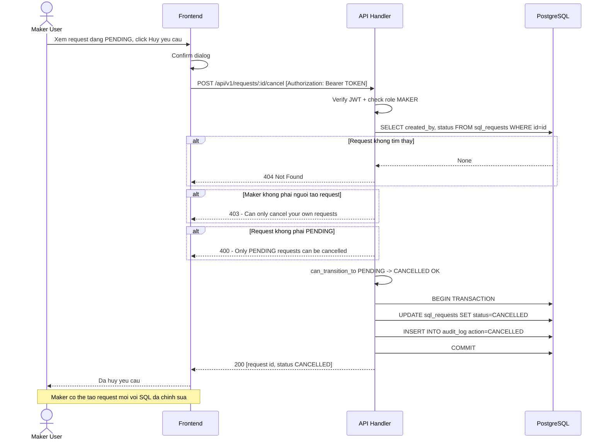
```mermaid
sequenceDiagram
    actor Maker as Maker User
    participant FE as Frontend
    participant BE as API Handler
    participant DB as PostgreSQL

    Maker->>FE: Xem request dang PENDING, click Huy yeu cau
    FE->>FE: Confirm dialog
    FE->>BE: POST /api/v1/requests/:id/cancel [Authorization: Bearer TOKEN]

    BE->>BE: Verify JWT + check role MAKER
    BE->>DB: SELECT created_by, status FROM sql_requests WHERE id=id

    alt Request khong tim thay
        DB-->>BE: None
        BE-->>FE: 404 Not Found
    end

    alt Maker khong phai nguoi tao request
        BE-->>FE: 403 - Can only cancel your own requests
    end

    alt Request khong phai PENDING
        BE-->>FE: 400 - Only PENDING requests can be cancelled
    end

    BE->>BE: can_transition_to PENDING -> CANCELLED OK

    BE->>DB: BEGIN TRANSACTION
    BE->>DB: UPDATE sql_requests SET status=CANCELLED
    BE->>DB: INSERT INTO audit_log action=CANCELLED
    BE->>DB: COMMIT

    BE-->>FE: 200 [request id, status CANCELLED]
    FE-->>Maker: Da huy yeu cau
    Note over FE,Maker: Maker co the tao request moi voi SQL da chinh sua
```

---

## [SF-08] SQL Execution chi tiet (Timeout & Transaction)

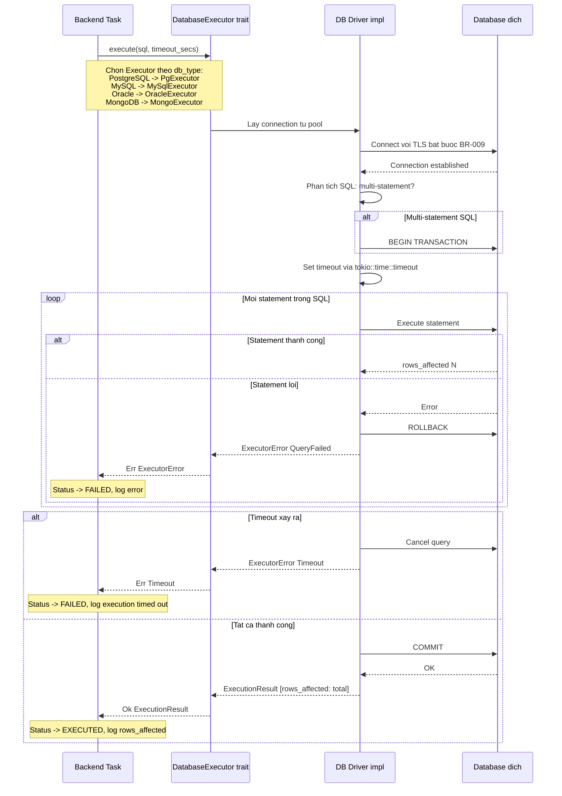
```mermaid
sequenceDiagram
    participant BE as Backend Task
    participant Executor as DatabaseExecutor trait
    participant Driver as DB Driver impl
    participant TargetDB as Database dich

    BE->>Executor: execute(sql, timeout_secs)
    Note over BE,Executor: Chon Executor theo db_type:<br/>PostgreSQL -> PgExecutor<br/>MySQL -> MySqlExecutor<br/>Oracle -> OracleExecutor<br/>MongoDB -> MongoExecutor

    Executor->>Driver: Lay connection tu pool
    Driver->>TargetDB: Connect voi TLS bat buoc BR-009
    TargetDB-->>Driver: Connection established

    Driver->>Driver: Phan tich SQL: multi-statement?
    alt Multi-statement SQL
        Driver->>TargetDB: BEGIN TRANSACTION
    end

    Driver->>Driver: Set timeout via tokio::time::timeout

    loop Moi statement trong SQL
        Driver->>TargetDB: Execute statement
        alt Statement thanh cong
            TargetDB-->>Driver: rows_affected N
        else Statement loi
            TargetDB-->>Driver: Error
            Driver->>TargetDB: ROLLBACK
            Driver-->>Executor: ExecutorError QueryFailed
            Executor-->>BE: Err ExecutorError
            Note over BE: Status -> FAILED, log error
        end
    end

    alt Timeout xay ra
        Driver->>TargetDB: Cancel query
        Driver-->>Executor: ExecutorError Timeout
        Executor-->>BE: Err Timeout
        Note over BE: Status -> FAILED, log execution timed out
    else Tat ca thanh cong
        Driver->>TargetDB: COMMIT
        TargetDB-->>Driver: OK
        Driver-->>Executor: ExecutionResult [rows_affected: total]
        Executor-->>BE: Ok ExecutionResult
        Note over BE: Status -> EXECUTED, log rows_affected
    end
```

---

## [SF-09] WebSocket Realtime Notification

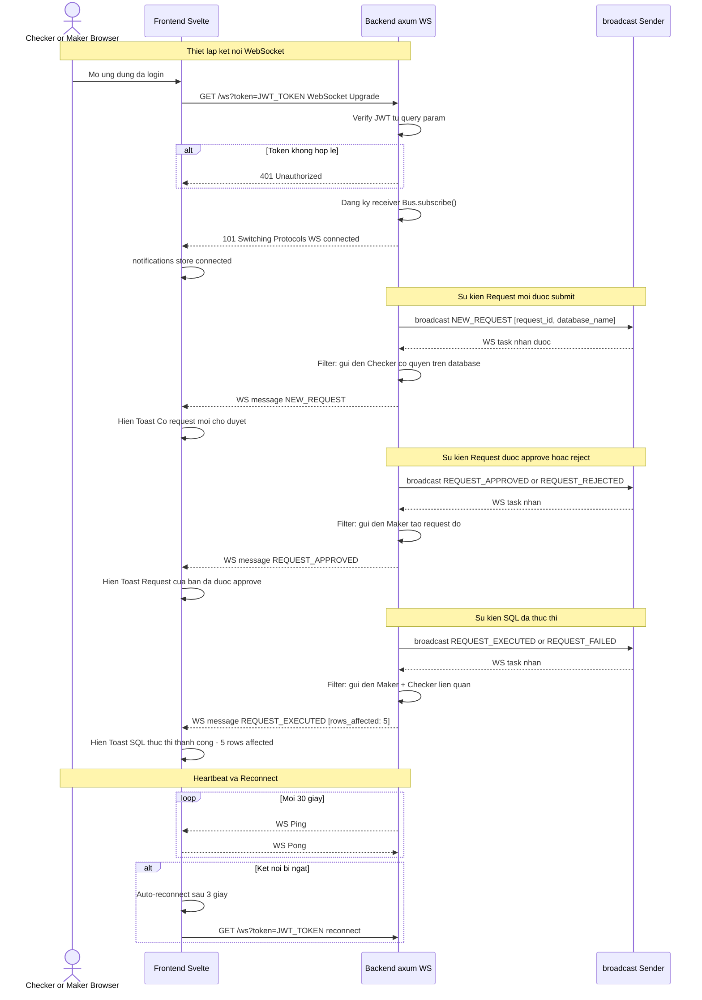
```mermaid
sequenceDiagram
    actor User as Checker or Maker Browser
    participant FE as Frontend Svelte
    participant BE as Backend axum WS
    participant Bus as broadcast Sender

    Note over User,BE: Thiet lap ket noi WebSocket
    User->>FE: Mo ung dung da login
    FE->>BE: GET /ws?token=JWT_TOKEN WebSocket Upgrade
    BE->>BE: Verify JWT tu query param
    alt Token khong hop le
        BE-->>FE: 401 Unauthorized
    end
    BE->>BE: Dang ky receiver Bus.subscribe()
    BE-->>FE: 101 Switching Protocols WS connected
    FE->>FE: notifications store connected

    Note over BE,Bus: Su kien Request moi duoc submit
    BE->>Bus: broadcast NEW_REQUEST [request_id, database_name]
    Bus-->>BE: WS task nhan duoc
    BE->>BE: Filter: gui den Checker co quyen tren database
    BE-->>FE: WS message NEW_REQUEST
    FE->>FE: Hien Toast Co request moi cho duyet

    Note over BE,Bus: Su kien Request duoc approve hoac reject
    BE->>Bus: broadcast REQUEST_APPROVED or REQUEST_REJECTED
    Bus-->>BE: WS task nhan
    BE->>BE: Filter: gui den Maker tao request do
    BE-->>FE: WS message REQUEST_APPROVED
    FE->>FE: Hien Toast Request cua ban da duoc approve

    Note over BE,Bus: Su kien SQL da thuc thi
    BE->>Bus: broadcast REQUEST_EXECUTED or REQUEST_FAILED
    Bus-->>BE: WS task nhan
    BE->>BE: Filter: gui den Maker + Checker lien quan
    BE-->>FE: WS message REQUEST_EXECUTED [rows_affected: 5]
    FE->>FE: Hien Toast SQL thuc thi thanh cong - 5 rows affected

    Note over User,BE: Heartbeat va Reconnect
    loop Moi 30 giay
        BE-->>FE: WS Ping
        FE-->>BE: WS Pong
    end
    alt Ket noi bi ngat
        FE->>FE: Auto-reconnect sau 3 giay
        FE->>BE: GET /ws?token=JWT_TOKEN reconnect
    end
```

---

## [SF-10] Admin quan ly Database Connections

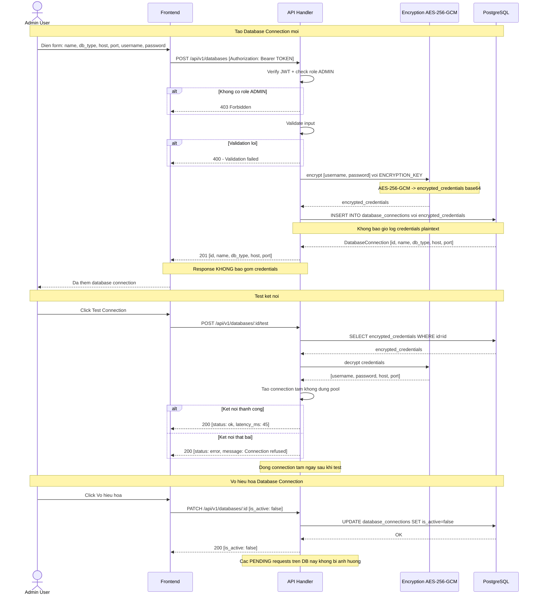
```mermaid
sequenceDiagram
    actor Admin as Admin User
    participant FE as Frontend
    participant BE as API Handler
    participant Crypto as Encryption AES-256-GCM
    participant DB as PostgreSQL

    Note over Admin,DB: Tao Database Connection moi
    Admin->>FE: Dien form: name, db_type, host, port, username, password
    FE->>BE: POST /api/v1/databases [Authorization: Bearer TOKEN]

    BE->>BE: Verify JWT + check role ADMIN
    alt Khong co role ADMIN
        BE-->>FE: 403 Forbidden
    end

    BE->>BE: Validate input
    alt Validation loi
        BE-->>FE: 400 - Validation failed
    end

    BE->>Crypto: encrypt [username, password] voi ENCRYPTION_KEY
    Note over Crypto: AES-256-GCM -> encrypted_credentials base64
    Crypto-->>BE: encrypted_credentials

    BE->>DB: INSERT INTO database_connections voi encrypted_credentials
    Note over BE,DB: Khong bao gio log credentials plaintext
    DB-->>BE: DatabaseConnection [id, name, db_type, host, port]

    BE-->>FE: 201 [id, name, db_type, host, port]
    Note over BE,FE: Response KHONG bao gom credentials
    FE-->>Admin: Da them database connection

    Note over Admin,DB: Test ket noi
    Admin->>FE: Click Test Connection
    FE->>BE: POST /api/v1/databases/:id/test
    BE->>DB: SELECT encrypted_credentials WHERE id=id
    DB-->>BE: encrypted_credentials
    BE->>Crypto: decrypt credentials
    Crypto-->>BE: [username, password, host, port]
    BE->>BE: Tao connection tam khong dung pool
    alt Ket noi thanh cong
        BE-->>FE: 200 [status: ok, latency_ms: 45]
    else Ket noi that bai
        BE-->>FE: 200 [status: error, message: Connection refused]
    end
    Note over BE: Dong connection tam ngay sau khi test

    Note over Admin,DB: Vo hieu hoa Database Connection
    Admin->>FE: Click Vo hieu hoa
    FE->>BE: PATCH /api/v1/databases/:id [is_active: false]
    BE->>DB: UPDATE database_connections SET is_active=false
    DB-->>BE: OK
    BE-->>FE: 200 [is_active: false]
    Note over BE: Cac PENDING requests tren DB nay khong bi anh huong
```

---

## [SF-11] Admin cap va thu hoi quyen User tren Database

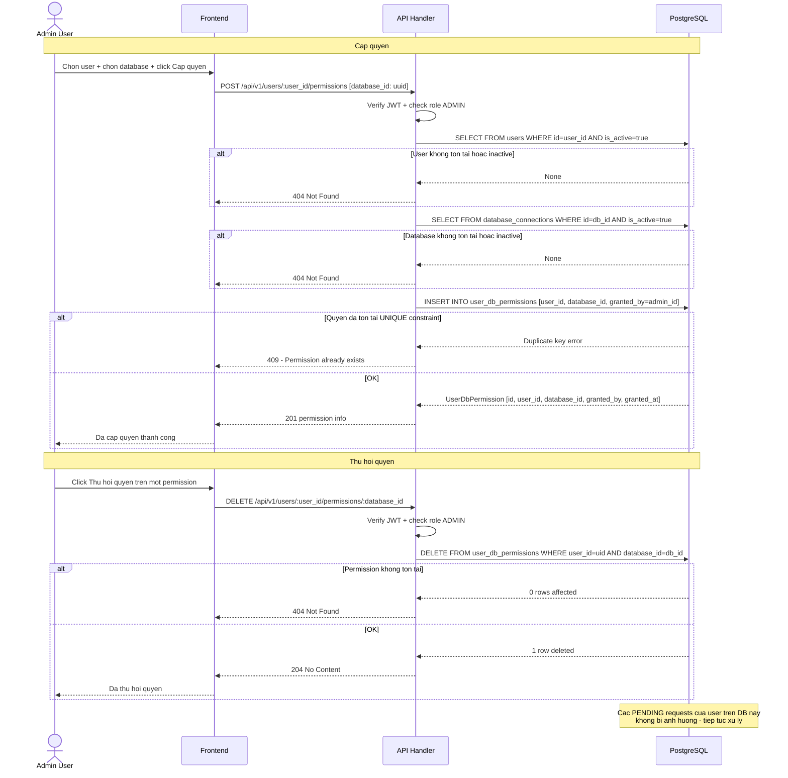
```mermaid
sequenceDiagram
    actor Admin as Admin User
    participant FE as Frontend
    participant BE as API Handler
    participant DB as PostgreSQL

    Note over Admin,DB: Cap quyen
    Admin->>FE: Chon user + chon database + click Cap quyen
    FE->>BE: POST /api/v1/users/:user_id/permissions [database_id: uuid]

    BE->>BE: Verify JWT + check role ADMIN
    BE->>DB: SELECT FROM users WHERE id=user_id AND is_active=true
    alt User khong ton tai hoac inactive
        DB-->>BE: None
        BE-->>FE: 404 Not Found
    end

    BE->>DB: SELECT FROM database_connections WHERE id=db_id AND is_active=true
    alt Database khong ton tai hoac inactive
        DB-->>BE: None
        BE-->>FE: 404 Not Found
    end

    BE->>DB: INSERT INTO user_db_permissions [user_id, database_id, granted_by=admin_id]
    alt Quyen da ton tai UNIQUE constraint
        DB-->>BE: Duplicate key error
        BE-->>FE: 409 - Permission already exists
    else OK
        DB-->>BE: UserDbPermission [id, user_id, database_id, granted_by, granted_at]
        BE-->>FE: 201 permission info
        FE-->>Admin: Da cap quyen thanh cong
    end

    Note over Admin,DB: Thu hoi quyen
    Admin->>FE: Click Thu hoi quyen tren mot permission
    FE->>BE: DELETE /api/v1/users/:user_id/permissions/:database_id

    BE->>BE: Verify JWT + check role ADMIN
    BE->>DB: DELETE FROM user_db_permissions WHERE user_id=uid AND database_id=db_id
    alt Permission khong ton tai
        DB-->>BE: 0 rows affected
        BE-->>FE: 404 Not Found
    else OK
        DB-->>BE: 1 row deleted
        BE-->>FE: 204 No Content
        FE-->>Admin: Da thu hoi quyen
    end

    Note over DB: Cac PENDING requests cua user tren DB nay<br/>khong bi anh huong - tiep tuc xu ly
```

---

## [SF-12] Health Check Endpoint

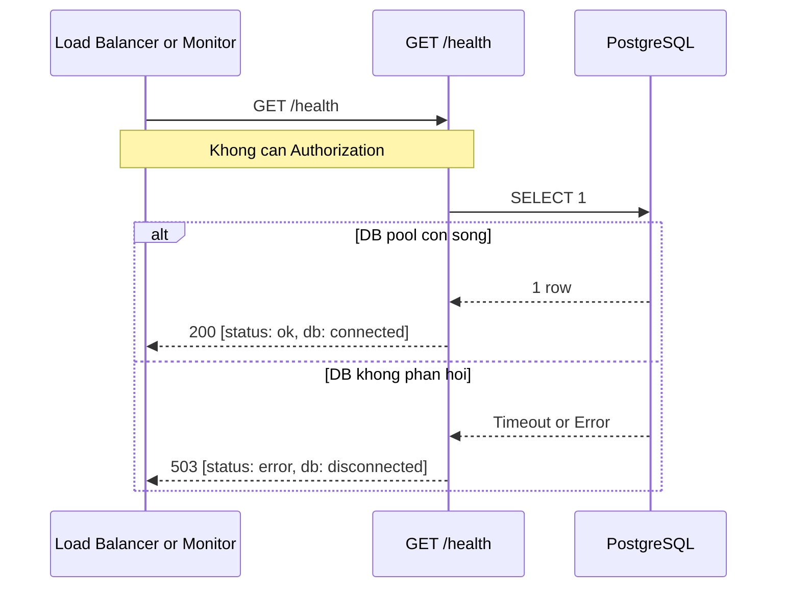
```mermaid
sequenceDiagram
    participant Client as Load Balancer or Monitor
    participant BE as GET /health
    participant DB as PostgreSQL

    Client->>BE: GET /health
    Note over Client,BE: Khong can Authorization

    BE->>DB: SELECT 1
    alt DB pool con song
        DB-->>BE: 1 row
        BE-->>Client: 200 [status: ok, db: connected]
    else DB khong phan hoi
        DB-->>BE: Timeout or Error
        BE-->>Client: 503 [status: error, db: disconnected]
    end
```

---

## Tong hop: State Machine SqlRequest

Toan bo vong doi cua mot SqlRequest:

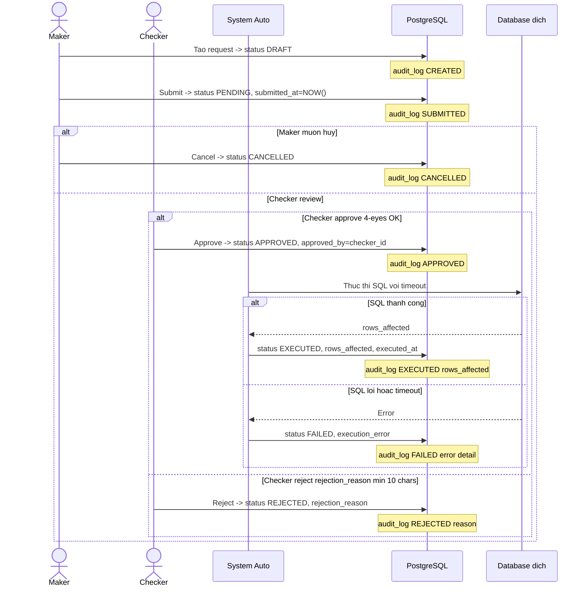
```mermaid
sequenceDiagram
    actor Maker as Maker
    actor Checker as Checker
    participant System as System Auto
    participant DB as PostgreSQL
    participant TargetDB as Database dich

    Maker->>DB: Tao request -> status DRAFT
    Note over DB: audit_log CREATED

    Maker->>DB: Submit -> status PENDING, submitted_at=NOW()
    Note over DB: audit_log SUBMITTED

    alt Maker muon huy
        Maker->>DB: Cancel -> status CANCELLED
        Note over DB: audit_log CANCELLED
    else Checker review
        alt Checker approve 4-eyes OK
            Checker->>DB: Approve -> status APPROVED, approved_by=checker_id
            Note over DB: audit_log APPROVED
            System->>TargetDB: Thuc thi SQL voi timeout
            alt SQL thanh cong
                TargetDB-->>System: rows_affected
                System->>DB: status EXECUTED, rows_affected, executed_at
                Note over DB: audit_log EXECUTED rows_affected
            else SQL loi hoac timeout
                TargetDB-->>System: Error
                System->>DB: status FAILED, execution_error
                Note over DB: audit_log FAILED error detail
            end
        else Checker reject rejection_reason min 10 chars
            Checker->>DB: Reject -> status REJECTED, rejection_reason
            Note over DB: audit_log REJECTED reason
        end
    end
```

---

## Ghi chu thiet ke

| Luong | Layer enforce | Business Rule |
|-------|---------------|---------------|
| SF-04 | API + DB | BR-006 permission check, BR-005 audit log |
| SF-05 | API + DB constraint | BR-001 4-eyes, BR-003 state machine, BR-007 transaction |
| SF-06 | API | BR-004 rejection reason min 10, BR-001 4-eyes |
| SF-07 | API | BR-002 chi Maker cua request, BR-003 state machine |
| SF-08 | Executor | BR-007 transaction, BR-008 timeout, BR-009 TLS |
| SF-09 | WS | Realtime notification sau moi state change |
| SF-10 | API | BR-009 encrypt credentials |
| SF-11 | API + DB | Least privilege explicit grant per DB |
